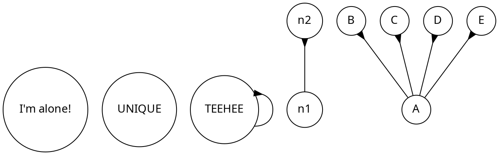
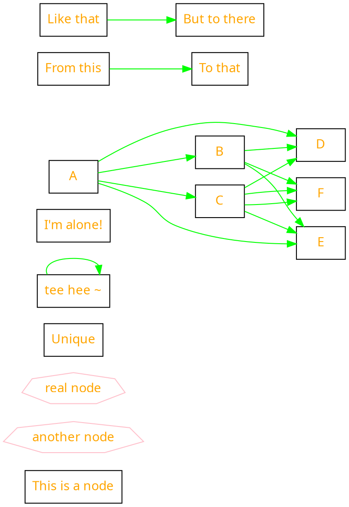

## Samples

While you can inspect the files themselves, I'll provide here the code (both C# and dot) and also the output diagrams for your convenience.

### Basic Syntax
For those who prefer chaining initializations.
```csharp
// Instantiate a new, empty directed graph
Graph graph = new() { Type = GraphType.Directed };

// Create new attributes for the graph
graph.Attributes = new GraphAttributes
{
    FontName     = "Test",
    FontColor    = "cccccc",
    RankDir      = RankDir.BT,
    LayoutEngine = LayoutEngine.Circo
};

// Create new attributes for all graph nodes
graph.Nodes.Attributes = new NodeAttributes
{
    FontName  = "Test2",
    FontColor = "cccccc",
    Shape     = Shape.Circle,
    FillColor = "cccccc"
};

// Create new attributes for all graph edges
graph.Edges.Attributes = new EdgeAttributes
{
    ArrowHead = ArrowType.Inv,
    ArrowTail = ArrowType.Tee
};

// You can define nodes like this
Node n1   = new("UNIQUE");
Node n2   = new("TEEHEE");
Node solo = new("I'm alone!");

// You can register nodes to the graph instance, but
graph.Nodes.Add(solo);

// You don't have to register them to the graph instance if you register the edge using them
Edge e1 = new("n1", "n2");
graph.Edges.Add(e1);

// My preferred method is to define all edges like this in one go
// you can add predefined edges, or create on the fly.
// 1:N, N:1, and N:N assignment is also supported
// this is closest to vanilla graphviz's syntax for fast iteration
// todo: node to labels are not yet allowed ;)
graph.Edges.AddRange([
    new Edge("A", "B"),
    // new(node, "C"),
    new Edge(n1,  n2),
    new Edge("A", ["C", "D", "E"])
]);

// accessibility methods
// graph.ToString() converts the graph to a dot string.
// graph.PrintToConsole() wraps that ToString with a WriteLine.

return graph;
```
producing the following `dot`:



and the diagram:


### Fluent
For those who prefer chaining methods.

```csharp
// instantiate a graph builder
Graph graph = new GraphBuilder(GraphType.Directed)
    // define the Graph attributes
    // this will be `graph [attr=value]`
    .WithAttributes(graphAttr => graphAttr
        .FontName("Libertinus Sans")
        .FontColor("cccccc")
        .RankDir(RankDir.LR)
        .LayoutEngine(LayoutEngine.Dot)
    )
    // define the Graph Node attributes
    // this will be `node [attr=value]`
    .WithNodeAttributes(graphNodeAttr => graphNodeAttr
        .FontName("Libertinus Sans")
        .FontColor("orange")
        .Shape(Shape.Rectangle)
        .FillColor("pink")
    )
    // define the Graph Node attributes
    // this will be `node [attr=value]`
    .WithEdgeAttributes(graphEdgeAttr => graphEdgeAttr
        .Color("green")
    )
    // builds the graph object
    .Build();
// You can define nodes like this
Node n1   = new(id: "Unique");
Node n2   = new(id: "tee hee ~");
Node solo = new(id: "I'm alone!");
// You can instantiate another builder using a different graph and extend it
Graph continuation = new GraphBuilder(graph)
    // Adding a node using only ids
    .AddNode("This is a node")
    // Adding a node using the node builder
    .AddNode(new NodeBuilder("another node")
        .WithAttributes(nodeAttr => nodeAttr
            .Color("pink")
            .Shape(Shape.Septagon)
        )
        .Build()
    )
    // or alternatively, using the Action<T> syntax
    .AddNode("real node", c => c
        .WithAttributes(nodeAttr => nodeAttr
            .Color("pink")
            .Shape(Shape.Septagon)
        )
    )
    // Adding multiple nodes at once
    .AddNodes([n1, n2, solo])
    // Adding edges
    .AddEdge("A", "B")
    .AddEdge(n1,  n2)
    .AddEdge("A", ["C", "D", "E"])
    // Multiple edges at once
    .AddEdges([
            new Edge(from: ["B", "C"], to: ["D", "E", "F"]),
            new Edge("C",              "F")
        ]
    )
    // Adding an edge using the fluent builder
    .AddEdge(new EdgeBuilder()
        .From("From this")
        .To("To that")
        .Build()
    )
    // Adding a fluent edge with attributes
    .AddEdge(edge => edge
        .From("Like that")
        .To("But to there")
        .WithAttributes(edgeAttr => edgeAttr
            .Color("green"))
    )
    .Build();
return continuation;
```
producing the following `dot`:



and the diagram:


### Library Structure
This is the most complex, but currently this is only nesting clusters. Theoretically ports should work, but since this is only a visualization of the library'es hierarchy, I haven't tested that yet.

```csharp
// graph type is required to be passed
Graph graph = new GraphBuilder(GraphType.Directed)
    // graph attributes
    .WithAttributes(graph => graph
        .Label("Rikai's Graphviz Library Structure!")
        .LabelLocation(LabelLocation.Top)
        .Splines(Splines.Compound)
        .BgColor("white")
    )
    // node attributes
    .WithNodeAttributes(graphNodes => graphNodes
        .Shape(Shape.Rectangle)
        .Style(NodeStyle.Filled)
        .Color("white")
        .FontSize(9)
    )
    // edge attributes
    .WithEdgeAttributes(graphEdges => graphEdges
        .ArrowHead(ArrowType.Vee)
        .Style(EdgeStyle.Dashed)
        .FontSize(9)
    )
    // Cluster: Rikai.Graphviz
    .AddCluster(id: "gv", label: "Rikai.Graphviz", configure: cluster => cluster
            .WithAttributes(clusterAttr => clusterAttr
                .BgColor("white")
                .PenColor(colors.Blue)
            )
            .WithNodeAttributes(nodeAttr => nodeAttr
                .Color("skyblue")
            )
            // Cluster: Attributes
            .AddCluster(id: "gv_attr", label: "Attributes", configure: cluster2 => cluster2
                .WithAttributes(clusterAttr => clusterAttr
                    .BgColor("white")
                    .PenColor(colors.Blue)
                )
                .WithNodeAttributes(nodeAttr => nodeAttr
                    .Color("skyblue")
                )
                // Table: Attributes
                .AddHtml("t_attr", html => html
                    .WithAttributes(htmlAttr => htmlAttr
                        .Border(1)
                        .CellBorder(1)
                        .CellSpacing(0)
                        .CellPadding(5)
                        .Color(colors.Cyan)
                    )
                    .WithNodeAttributes(node => node
                        .Shape(Shape.Plain)
                    )
                    // Row: class | cluster
                    .AddRow(row => row
                        .AddCell("", "class", cell => cell
                            .WithAttributes(cellAttr => cellAttr
                                .ColSpan(1)
                                .Align(HtmlAlign.Left)
                            )
                        )
                        .AddCell("", "Cluster Attributes", cell => cell
                            .WithAttributes(cellAttr => cellAttr
                                .ColSpan(1)
                                .Align(HtmlAlign.Right)
                            )
                        )
                    )
                    // Row: class | edge
                    .AddRow(row => row
                        .AddCell("", "class", cell => cell
                            .WithAttributes(cellAttr => cellAttr
                                .ColSpan(1)
                                .Align(HtmlAlign.Left)
                            )
                        )
                        .AddCell("", "Edge Attributes", cell => cell
                            .WithAttributes(cellAttr => cellAttr
                                .ColSpan(1)
                                .Align(HtmlAlign.Right)
                            )
                        )
                    )
                    // Row: class | graph
                    .AddRow(row => row
                        .AddCell("", "class", cell => cell
                            .WithAttributes(cellAttr => cellAttr
                                .ColSpan(1)
                                .Align(HtmlAlign.Left)
                            )
                        )
                        .AddCell("", "Graph Attributes", cell => cell
                            .WithAttributes(cellAttr => cellAttr
                                .ColSpan(1)
                                .Align(HtmlAlign.Right)
                            )
                        )
                    )
                    // Row: class | htmlcell
                    .AddRow(row => row
                        .AddCell("", "class", cell => cell
                            .WithAttributes(cellAttr => cellAttr
                                .ColSpan(1)
                                .Align(HtmlAlign.Left)
                            )
                        )
                        .AddCell("", "Html Cell Attributes", cell => cell
                            .WithAttributes(cellAttr => cellAttr
                                .ColSpan(1)
                                .Align(HtmlAlign.Right)
                            )
                        )
                    )
                    // Row: class | html table
                    .AddRow(row => row
                        .AddCell("", "class", cell => cell
                            .WithAttributes(cellAttr => cellAttr
                                .ColSpan(1)
                                .Align(HtmlAlign.Left)
                            )
                        )
                        .AddCell("", "Html Table Attributes", cell => cell
                            .WithAttributes(cellAttr => cellAttr
                                .ColSpan(1)
                                .Align(HtmlAlign.Right)
                            )
                        )
                    )
                    // Row: class | node
                    .AddRow(row => row
                        .AddCell("", "class", cell => cell
                            .WithAttributes(cellAttr => cellAttr
                                .ColSpan(1)
                                .Align(HtmlAlign.Left)
                            )
                        )
                        .AddCell("", "Node Attributes", cell => cell
                            .WithAttributes(cellAttr => cellAttr
                                .ColSpan(1)
                                .Align(HtmlAlign.Right)
                            )
                        )
                    )
                    // Row: class | edge
                    .AddRow(row => row
                        .AddCell("", "class", cell => cell
                            .WithAttributes(cellAttr => cellAttr
                                .ColSpan(1)
                                .Align(HtmlAlign.Left)
                            )
                        )
                        .AddCell("", "Edge Attributes", cell => cell
                            .WithAttributes(cellAttr => cellAttr
                                .ColSpan(1)
                                .Align(HtmlAlign.Right)
                            )
                        )
                    )
                )
            )
            // Cluster: Attribute Types
            .AddCluster(id: "gv_attrTypes", label: "Attribute Types", configure: cluster2 => cluster2
                .WithAttributes(cellAttr => cellAttr
                    .BgColor("white")
                    .PenColor(colors.Cyan)
                )
                .WithNodeAttributes(nodeAttr => nodeAttr
                    .Shape(Shape.Plain)
                    .Color("skyblue")
                )
                // Table: Attribute Types
                .AddHtml("t_attrTypes", html => html
                    .WithAttributes(htmlAttr => htmlAttr
                        .Border(1)
                        .CellBorder(1)
                        .CellSpacing(0)
                        .CellPadding(5)
                        .Color(colors.Cyan)
                    )
                    .WithNodeAttributes(node => node.Shape(Shape.Plain)
                    )
                    // Row: ArrowType
                    .AddRow(row => row
                        .AddCell("", "enum", cell => cell
                            .WithAttributes(cellAttr => cellAttr
                                .ColSpan(1)
                                .Align(HtmlAlign.Left)
                            )
                        )
                        .AddCell("", "ArrowType", cell => cell
                            .WithAttributes(cellAttr => cellAttr
                                .ColSpan(1)
                                .Align(HtmlAlign.Right)
                            )
                        )
                    )
                    // Row: EdgeStyle
                    .AddRow(row => row
                        .AddCell("enum", "enum", cell => cell
                            .WithAttributes(cellAttr => cellAttr
                                .ColSpan(1)
                                .Align(HtmlAlign.Left)
                            )
                        )
                        .AddCell("", "EdgeStyle", cell => cell
                            .WithAttributes(cellAttr => cellAttr
                                .ColSpan(1)
                                .Align(HtmlAlign.Right)
                            )
                        )
                    )
                    // Row: EdgeStyle
                    .AddRow(row => row
                        .AddCell("enum", "enum", cell => cell
                            .WithAttributes(cellAttr => cellAttr
                                .ColSpan(1)
                                .Align(HtmlAlign.Left)
                            )
                        )
                        .AddCell("", "EdgeStyle", cell => cell
                            .WithAttributes(cellAttr => cellAttr
                                .ColSpan(1)
                                .Align(HtmlAlign.Right)
                            )
                        )
                    )
                    // Row: GraphType
                    .AddRow(row => row
                        .AddCell("enum", "enum", cell => cell
                            .WithAttributes(cellAttr => cellAttr
                                .ColSpan(1)
                                .Align(HtmlAlign.Left)
                            )
                        )
                        .AddCell("", "GraphType", cell => cell
                            .WithAttributes(cellAttr => cellAttr
                                .ColSpan(1)
                                .Align(HtmlAlign.Right)
                            )
                        )
                    )
                    // Row: LabelLocation
                    .AddRow(row => row
                        .AddCell("enum", "enum", cell => cell
                            .WithAttributes(cellAttr => cellAttr
                                .ColSpan(1)
                                .Align(HtmlAlign.Left)
                            )
                        )
                        .AddCell("", "LabelLocation", cell => cell
                            .WithAttributes(cellAttr => cellAttr
                                .ColSpan(1)
                                .Align(HtmlAlign.Right)
                            )
                        )
                    )
                    // Row: LayoutEngine
                    .AddRow(row => row
                        .AddCell("enum", "enum", cell => cell
                            .WithAttributes(cellAttr => cellAttr
                                .ColSpan(1)
                                .Align(HtmlAlign.Left)
                            )
                        )
                        .AddCell("", "LayoutEngine", cell => cell
                            .WithAttributes(cellAttr => cellAttr
                                .ColSpan(1)
                                .Align(HtmlAlign.Right)
                            )
                        )
                    )
                    // Row: NodeStyle
                    .AddRow(row => row
                        .AddCell("enum", "enum", cell => cell
                            .WithAttributes(cellAttr => cellAttr
                                .ColSpan(1)
                                .Align(HtmlAlign.Left)
                            )
                        )
                        .AddCell("", "NodeStyle", cell => cell
                            .WithAttributes(cellAttr => cellAttr
                                .ColSpan(1)
                                .Align(HtmlAlign.Right)
                            )
                        )
                    )
                    // Row: Overlap
                    .AddRow(row => row
                        .AddCell("enum", "enum", cell => cell
                            .WithAttributes(cellAttr => cellAttr
                                .ColSpan(1)
                                .Align(HtmlAlign.Left)
                            )
                        )
                        .AddCell("", "Overlap", cell => cell
                            .WithAttributes(cellAttr => cellAttr
                                .ColSpan(1)
                                .Align(HtmlAlign.Right)
                            )
                        )
                    )
                    // Row: PortPos
                    .AddRow(row => row
                        .AddCell("enum", "enum", cell => cell
                            .WithAttributes(cellAttr => cellAttr
                                .ColSpan(1)
                                .Align(HtmlAlign.Left)
                            )
                        )
                        .AddCell("", "PortPos", cell => cell
                            .WithAttributes(cellAttr => cellAttr
                                .ColSpan(1)
                                .Align(HtmlAlign.Right)
                            )
                        )
                    )
                    // Row: RankDir
                    .AddRow(row => row
                        .AddCell("enum", "enum", cell => cell
                            .WithAttributes(cellAttr => cellAttr
                                .ColSpan(1)
                                .Align(HtmlAlign.Left)
                            )
                        )
                        .AddCell("", "RankDir", cell => cell
                            .WithAttributes(cellAttr => cellAttr
                                .ColSpan(1)
                                .Align(HtmlAlign.Right)
                            )
                        )
                    )
                    // Row: Shape
                    .AddRow(row => row
                        .AddCell("enum", "enum", cell => cell
                            .WithAttributes(cellAttr => cellAttr
                                .ColSpan(1)
                                .Align(HtmlAlign.Left)
                            )
                        )
                        .AddCell("", "Shape", cell => cell
                            .WithAttributes(cellAttr => cellAttr
                                .ColSpan(1)
                                .Align(HtmlAlign.Right)
                            )
                        )
                    )
                    // Row: Splines
                    .AddRow(row => row
                        .AddCell("enum", "enum", cell => cell
                            .WithAttributes(cellAttr => cellAttr
                                .ColSpan(1)
                                .Align(HtmlAlign.Left)
                            )
                        )
                        .AddCell("", "Splines", cell => cell
                            .WithAttributes(cellAttr => cellAttr
                                .ColSpan(1)
                                .Align(HtmlAlign.Right)
                            )
                        )
                    )
                )
            )
            // Cluster: DotFormat
            .AddCluster(id: "gv_dot", label: "DotFormat", configure: cluster2 => cluster2
                .WithAttributes(clusterAttr => clusterAttr
                    .BgColor("white")
                    .PenColor(colors.Blue)
                )
                .WithNodeAttributes(nodeAttr => nodeAttr
                    .Color("skyblue")
                )
                // Table: DotFormat
                .AddHtml("t_dot", html => html
                    .WithAttributes(htmlAttr => htmlAttr
                        .Border(1)
                        .CellBorder(1)
                        .CellSpacing(0)
                        .CellPadding(5)
                        .Color(colors.Cyan)
                    )
                    .WithNodeAttributes(node => node
                        .Shape(Shape.Plain)
                    )
                    // Row: DotGenerator
                    .AddRow(row => row
                        .AddCell("", "class", cell => cell
                            .WithAttributes(cellAttr => cellAttr
                                .ColSpan(1)
                                .Align(HtmlAlign.Left)
                            )
                        )
                        .AddCell("", "DotGenerator", cell => cell
                            .WithAttributes(cellAttr => cellAttr
                                .ColSpan(1)
                                .Align(HtmlAlign.Right)
                            )
                        )
                    )
                    // Row: GraphFormatter
                    .AddRow(row => row
                        .AddCell("", "class", cell => cell
                            .WithAttributes(cellAttr => cellAttr
                                .ColSpan(1)
                                .Align(HtmlAlign.Left)
                            )
                        )
                        .AddCell("", "GraphFormatter", cell => cell
                            .WithAttributes(cellAttr => cellAttr
                                .ColSpan(1)
                                .Align(HtmlAlign.Right)
                            )
                        )
                    )
                    // Row: Helpers
                    .AddRow(row => row
                        .AddCell("", "class", cell => cell
                            .WithAttributes(cellAttr => cellAttr
                                .ColSpan(1)
                                .Align(HtmlAlign.Left)
                            )
                        )
                        .AddCell("", "Helpers", cell => cell
                            .WithAttributes(cellAttr => cellAttr
                                .ColSpan(1)
                                .Align(HtmlAlign.Right)
                            )
                        )
                    )
                )
            )
            // Cluster: Builders
            .AddCluster(id: "gv_builders", label: "Builders", configure: cluster2 => cluster2
                .WithAttributes(cellAttr => cellAttr
                    .BgColor("white")
                    .PenColor(colors.Cyan)
                )
                .WithNodeAttributes(nodeAttr => nodeAttr
                    .Color("skyblue")
                )
                // Table: Types
                .AddHtml("t_builders", html => html
                    .WithAttributes(htmlAttr => htmlAttr
                        .Border(1)
                        .CellBorder(1)
                        .CellSpacing(0)
                        .CellPadding(5)
                        .Color(colors.Cyan)
                    )
                    .WithNodeAttributes(htmlNodeAttr => htmlNodeAttr.Shape(Shape.Plain))
                    // Row: ClusterBuilder
                    .AddRow(row => row
                        .AddCell("", "class", cell => cell
                            .WithAttributes(cellAttr => cellAttr
                                .ColSpan(1)
                                .Align(HtmlAlign.Left)
                            )
                        )
                        .AddCell("", "ClusterBuilder", cell => cell
                            .WithAttributes(cellAttr => cellAttr
                                .ColSpan(1)
                                .Align(HtmlAlign.Right)
                            )
                        )
                    )
                    // Row: EdgeBuilder
                    .AddRow(row => row
                        .AddCell("", "class", cell => cell
                            .WithAttributes(cellAttr => cellAttr
                                .ColSpan(1)
                                .Align(HtmlAlign.Left)
                            )
                        )
                        .AddCell("", "EdgeBuilder", cell => cell
                            .WithAttributes(cellAttr => cellAttr
                                .ColSpan(1)
                                .Align(HtmlAlign.Right)
                            )
                        )
                    )
                    // Row: GraphBuilder
                    .AddRow(row => row
                        .AddCell("", "class", cell => cell
                            .WithAttributes(cellAttr => cellAttr
                                .ColSpan(1)
                                .Align(HtmlAlign.Left)
                            )
                        )
                        .AddCell("", "GraphBuilder", cell => cell
                            .WithAttributes(cellAttr => cellAttr
                                .ColSpan(1)
                                .Align(HtmlAlign.Right)
                            )
                        )
                    )
                    // Row: NodeBuilder
                    .AddRow(row => row
                        .AddCell("", "class", cell => cell
                            .WithAttributes(cellAttr => cellAttr
                                .ColSpan(1)
                                .Align(HtmlAlign.Left)
                            )
                        )
                        .AddCell("", "NodeBuilder", cell => cell
                            .WithAttributes(cellAttr => cellAttr
                                .ColSpan(1)
                                .Align(HtmlAlign.Right)
                            )
                        )
                    )
                )
                // Cluster: Builders.Attributes
                // Cluster: Types
                .AddCluster(id: "gw_builders_attr", label: "Attributes", configure: cluster3 => cluster3
                    .WithAttributes(cellAttr => cellAttr
                        .BgColor("white")
                        .PenColor(colors.Cyan)
                    )
                    .WithNodeAttributes(nodeAttr => nodeAttr
                        .Color("skyblue")
                    )
                    // Table: Types
                    .AddHtml("t_builders_attr", html => html
                        .WithAttributes(htmlAttr => htmlAttr
                            .Border(1)
                            .CellBorder(1)
                            .CellSpacing(0)
                            .CellPadding(5)
                            .Color(colors.Cyan)
                        )
                        .WithNodeAttributes(node => node.Shape(Shape.Plain))
                        // Row: ClusterAttributeBuilder
                        .AddRow(row => row
                            .AddCell("", "class", cell => cell
                                .WithAttributes(cellAttr => cellAttr
                                    .ColSpan(1)
                                    .Align(HtmlAlign.Left)
                                )
                            )
                            .AddCell("", "ClusterAttributeBuilder", cell => cell
                                .WithAttributes(cellAttr => cellAttr
                                    .ColSpan(1)
                                    .Align(HtmlAlign.Right)
                                )
                            )
                        )
                        // Row: EdgeAttributeBuilder
                        .AddRow(row => row
                            .AddCell("", "class", cell => cell
                                .WithAttributes(cellAttr => cellAttr
                                    .ColSpan(1)
                                    .Align(HtmlAlign.Left)
                                )
                            )
                            .AddCell("", "EdgeAttributeBuilder", cell => cell
                                .WithAttributes(cellAttr => cellAttr
                                    .ColSpan(1)
                                    .Align(HtmlAlign.Right)
                                )
                            )
                        )
                        // Row: GraphAttributeBuilder
                        .AddRow(row => row
                            .AddCell("", "class", cell => cell
                                .WithAttributes(cellAttr => cellAttr
                                    .ColSpan(1)
                                    .Align(HtmlAlign.Left)
                                )
                            )
                            .AddCell("", "GraphAttributeBuilder", cell => cell
                                .WithAttributes(cellAttr => cellAttr
                                    .ColSpan(1)
                                    .Align(HtmlAlign.Right)
                                )
                            )
                        )
                        // Row: NodeAttributeBuilder
                        .AddRow(row => row
                            .AddCell("", "class", cell => cell
                                .WithAttributes(cellAttr => cellAttr
                                    .ColSpan(1)
                                    .Align(HtmlAlign.Left)
                                )
                            )
                            .AddCell("", "NodeAttributeBuilder", cell => cell
                                .WithAttributes(cellAttr => cellAttr
                                    .ColSpan(1)
                                    .Align(HtmlAlign.Right)
                                )
                            )
                        )
                    )
                )
                // Cluster: Builders Html
                .AddCluster(id: "gw_builders_html", label: "Html", configure: cluster4 => cluster4
                    .WithAttributes(cellAttr => cellAttr
                        .BgColor("white")
                        .PenColor(colors.Cyan)
                    )
                    .WithNodeAttributes(nodeAttr => nodeAttr
                        .Color("skyblue")
                    )
                    // Table: Html
                    .AddHtml("t_builders_html", html => html
                        .WithAttributes(htmlAttr => htmlAttr
                            .Border(1)
                            .CellBorder(1)
                            .CellSpacing(0)
                            .CellPadding(5)
                            .Color(colors.Cyan)
                        )
                        .WithNodeAttributes(node => node.Shape(Shape.Plain))
                        // Row: HtmlCellBuilder
                        .AddRow(row => row
                            .AddCell("", "class", cell => cell
                                .WithAttributes(cellAttr => cellAttr
                                    .ColSpan(1)
                                    .Align(HtmlAlign.Left)
                                )
                            )
                            .AddCell("", "HtmlCellBuilder", cell => cell
                                .WithAttributes(cellAttr => cellAttr
                                    .ColSpan(1)
                                    .Align(HtmlAlign.Right)
                                )
                            )
                        )
                        // Row: HtmlRowBuilder
                        .AddRow(row => row
                            .AddCell("", "class", cell => cell
                                .WithAttributes(cellAttr => cellAttr
                                    .ColSpan(1)
                                    .Align(HtmlAlign.Left)
                                )
                            )
                            .AddCell("", "HtmlRowBuilder", cell => cell
                                .WithAttributes(cellAttr => cellAttr
                                    .ColSpan(1)
                                    .Align(HtmlAlign.Right)
                                )
                            )
                        )
                        // Row: HtmlTableBuilder
                        .AddRow(row => row
                            .AddCell("", "class", cell => cell
                                .WithAttributes(cellAttr => cellAttr
                                    .ColSpan(1)
                                    .Align(HtmlAlign.Left)
                                )
                            )
                            .AddCell("", "HtmlTableBuilder", cell => cell
                                .WithAttributes(cellAttr => cellAttr
                                    .ColSpan(1)
                                    .Align(HtmlAlign.Right)
                                )
                            )
                        )
                    )
                    // Cluster: Builders.Html.Attributes
                    .AddCluster("gv_builders_html_attr", "Attributes", configure: cluster5 => cluster5
                        .WithAttributes(cellAttr => cellAttr
                            .BgColor("white")
                            .PenColor(colors.Cyan)
                        )
                        .WithNodeAttributes(nodeAttr => nodeAttr
                            .Color("skyblue")
                        )
                        // Table: Builders.Html.Attributes
                        .AddHtml("t_builders_html_attr", html => html
                            .WithAttributes(htmlAttr => htmlAttr
                                .Border(1)
                                .CellBorder(1)
                                .CellSpacing(0)
                                .CellPadding(5)
                                .Color(colors.Cyan)
                            )
                            .WithNodeAttributes(htmlNodeAttr => htmlNodeAttr.Shape(Shape.Plain))
                            // Row: HtmlCellAttributesBuilder
                            .AddRow(row => row
                                .AddCell("", "class", cell => cell
                                    .WithAttributes(cellAttr => cellAttr
                                        .ColSpan(1)
                                        .Align(HtmlAlign.Left)
                                    )
                                )
                                .AddCell("", "HtmlCellAttributesBuilder", cell => cell
                                    .WithAttributes(cellAttr => cellAttr
                                        .ColSpan(1)
                                        .Align(HtmlAlign.Right)
                                    )
                                )
                            )
                            // Row: HtmlTableAttributesBuilder
                            .AddRow(row => row
                                .AddCell("", "class", cell => cell
                                    .WithAttributes(cellAttr => cellAttr
                                        .ColSpan(1)
                                        .Align(HtmlAlign.Left)
                                    )
                                )
                                .AddCell("", "HtmlTableAttributesBuilder", cell => cell
                                    .WithAttributes(cellAttr => cellAttr
                                        .ColSpan(1)
                                        .Align(HtmlAlign.Right)
                                    )
                                )
                            )
                        )
                    )
                )
            )
            // Cluster: Types
            .AddCluster(id: "gv_types", label: "Types", configure: cluster2 => cluster2
                .WithAttributes(cellAttr => cellAttr
                    .BgColor("white")
                    .PenColor(colors.Cyan)
                )
                .WithNodeAttributes(nodeAttr => nodeAttr
                    .Color("skyblue")
                )
                // Table: Types
                .AddHtml("t_types", html => html
                    .WithAttributes(htmlAttr => htmlAttr
                        .Border(1)
                        .CellBorder(1)
                        .CellSpacing(0)
                        .CellPadding(5)
                        .Color(colors.Cyan)
                    )
                    .WithNodeAttributes(htmlNodeAttr => htmlNodeAttr.Shape(Shape.Plain))
                    // Row: Cluster
                    .AddRow(row => row
                        .AddCell("", "class", cell => cell
                            .WithAttributes(cellAttr => cellAttr
                                .ColSpan(1)
                                .Align(HtmlAlign.Left)
                            )
                        )
                        .AddCell("", "Cluster", cell => cell
                            .WithAttributes(cellAttr => cellAttr
                                .ColSpan(1)
                                .Align(HtmlAlign.Right)
                            )
                        )
                    )
                    // Row: Edge
                    .AddRow(row => row
                        .AddCell("", "class", cell => cell
                            .WithAttributes(cellAttr => cellAttr
                                .ColSpan(1)
                                .Align(HtmlAlign.Left)
                            )
                        )
                        .AddCell("", "Edge", cell => cell
                            .WithAttributes(cellAttr => cellAttr
                                .ColSpan(1)
                                .Align(HtmlAlign.Right)
                            )
                        )
                    )
                    // Row: Graph
                    .AddRow(row => row
                        .AddCell("", "class", cell => cell
                            .WithAttributes(cellAttr => cellAttr
                                .ColSpan(1)
                                .Align(HtmlAlign.Left)
                            )
                        )
                        .AddCell("", "Graph", cell => cell
                            .WithAttributes(cellAttr => cellAttr
                                .ColSpan(1)
                                .Align(HtmlAlign.Right)
                            )
                        )
                    )
                    // Row: Node
                    .AddRow(row => row
                        .AddCell("", "class", cell => cell
                            .WithAttributes(cellAttr => cellAttr
                                .ColSpan(1)
                                .Align(HtmlAlign.Left)
                            )
                        )
                        .AddCell("", "Node", cell => cell
                            .WithAttributes(cellAttr => cellAttr
                                .ColSpan(1)
                                .Align(HtmlAlign.Right)
                            )
                        )
                    )
                )
                // Table: Collections
                .AddHtml("t_types_collection", html => html
                    .WithAttributes(htmlAttr => htmlAttr
                        .Border(1)
                        .CellBorder(1)
                        .CellSpacing(0)
                        .CellPadding(5)
                        .Color(colors.Cyan)
                    )
                    .WithNodeAttributes(htmlNodeAttr => htmlNodeAttr.Shape(Shape.Plain))
                    // Row: Title
                    .AddRow(row => row
                        .AddCell("t_attr_title", "Collections", cell => cell
                            .WithAttributes(cellAttr => cellAttr
                                .ColSpan(2)
                                .Align(HtmlAlign.Center)
                            )
                        )
                    )
                    // Row: ClusterEdges
                    .AddRow(row => row
                        .AddCell("", "class", cell => cell
                            .WithAttributes(cellAttr => cellAttr
                                .ColSpan(1)
                                .Align(HtmlAlign.Left)
                            )
                        )
                        .AddCell("", "ClusterEdges", cell => cell
                            .WithAttributes(cellAttr => cellAttr
                                .ColSpan(1)
                                .Align(HtmlAlign.Right)
                            )
                        )
                    )
                    // Row: ClusterNodes
                    .AddRow(row => row
                        .AddCell("", "class", cell => cell
                            .WithAttributes(cellAttr => cellAttr
                                .ColSpan(1)
                                .Align(HtmlAlign.Left)
                            )
                        )
                        .AddCell("", "ClusterNodes", cell => cell
                            .WithAttributes(cellAttr => cellAttr
                                .ColSpan(1)
                                .Align(HtmlAlign.Right)
                            )
                        )
                    )
                    // Row: GraphClusters
                    .AddRow(row => row
                        .AddCell("", "class", cell => cell
                            .WithAttributes(cellAttr => cellAttr
                                .ColSpan(1)
                                .Align(HtmlAlign.Left)
                            )
                        )
                        .AddCell("", "GraphClusters", cell => cell
                            .WithAttributes(cellAttr => cellAttr
                                .ColSpan(1)
                                .Align(HtmlAlign.Right)
                            )
                        )
                    )
                    // Row: GraphEdges
                    .AddRow(row => row
                        .AddCell("", "class", cell => cell
                            .WithAttributes(cellAttr => cellAttr
                                .ColSpan(1)
                                .Align(HtmlAlign.Left)
                            )
                        )
                        .AddCell("", "GraphEdges", cell => cell
                            .WithAttributes(cellAttr => cellAttr
                                .ColSpan(1)
                                .Align(HtmlAlign.Right)
                            )
                        )
                    )
                    // Row: GraphNodes
                    .AddRow(row => row
                        .AddCell("", "class", cell => cell
                            .WithAttributes(cellAttr => cellAttr
                                .ColSpan(1)
                                .Align(HtmlAlign.Left)
                            )
                        )
                        .AddCell("", "GraphNodes", cell => cell
                            .WithAttributes(cellAttr => cellAttr
                                .ColSpan(1)
                                .Align(HtmlAlign.Right)
                            )
                        )
                    )
                )
            )
        // finalize
    )
    .Build();
```
producing the following `dot`:



```dot
digraph{
    graph [
        "label" = "Rikai's Graphviz Library Structure!"
        "labelloc" = "top"
        "bgcolor" = "white"
        "splines" = "compound"
    ]
    node [
        "color" = "white"
        "shape" = "rectangle"
    ]
    edge [
        "arrowhead" = "vee"
    ]
    subgraph cluster_gv {
        "cluster" = "true"
        "label" = "Rikai.Graphviz"
        "bgcolor" = "white"
        "pencolor" = "#4d5de5"
        node [
            "color" = "skyblue"
        ]
        subgraph cluster_gv_types {
            "cluster" = "true"
            "label" = "Types"
            "bgcolor" = "white"
            "pencolor" = "#4897e8"
            node [
                "color" = "skyblue"
            ]
        t_types_collection [
            "shape" = "plain"
            "label" = <
            <TABLE BORDER="1"  CELLBORDER="1"  CELLPADDING="5"  CELLSPACING="0"  COLOR="#4897e8" >
                <TR>
                    <TD ALIGN="Center"  COLSPAN="2" >Collections</TD>
                </TR>
                <TR>
                    <TD ALIGN="Left"  COLSPAN="1" >class</TD>
                    <TD ALIGN="Right"  COLSPAN="1" >ClusterEdges</TD>
                </TR>
                <TR>
                    <TD ALIGN="Left"  COLSPAN="1" >class</TD>
                    <TD ALIGN="Right"  COLSPAN="1" >ClusterNodes</TD>
                </TR>
                <TR>
                    <TD ALIGN="Left"  COLSPAN="1" >class</TD>
                    <TD ALIGN="Right"  COLSPAN="1" >GraphClusters</TD>
                </TR>
                <TR>
                    <TD ALIGN="Left"  COLSPAN="1" >class</TD>
                    <TD ALIGN="Right"  COLSPAN="1" >GraphEdges</TD>
                </TR>
                <TR>
                    <TD ALIGN="Left"  COLSPAN="1" >class</TD>
                    <TD ALIGN="Right"  COLSPAN="1" >GraphNodes</TD>
                </TR>
            </TABLE>>];
        t_types [
            "shape" = "plain"
            "label" = <
            <TABLE BORDER="1"  CELLBORDER="1"  CELLPADDING="5"  CELLSPACING="0"  COLOR="#4897e8" >
                <TR>
                    <TD ALIGN="Left"  COLSPAN="1" >class</TD>
                    <TD ALIGN="Right"  COLSPAN="1" >Cluster</TD>
                </TR>
                <TR>
                    <TD ALIGN="Left"  COLSPAN="1" >class</TD>
                    <TD ALIGN="Right"  COLSPAN="1" >Edge</TD>
                </TR>
                <TR>
                    <TD ALIGN="Left"  COLSPAN="1" >class</TD>
                    <TD ALIGN="Right"  COLSPAN="1" >Graph</TD>
                </TR>
                <TR>
                    <TD ALIGN="Left"  COLSPAN="1" >class</TD>
                    <TD ALIGN="Right"  COLSPAN="1" >Node</TD>
                </TR>
            </TABLE>>];
        }
        subgraph cluster_gv_builders {
            "cluster" = "true"
            "label" = "Builders"
            "bgcolor" = "white"
            "pencolor" = "#4897e8"
            node [
                "color" = "skyblue"
            ]
        t_builders [
            "shape" = "plain"
            "label" = <
            <TABLE BORDER="1"  CELLBORDER="1"  CELLPADDING="5"  CELLSPACING="0"  COLOR="#4897e8" >
                <TR>
                    <TD ALIGN="Left"  COLSPAN="1" >class</TD>
                    <TD ALIGN="Right"  COLSPAN="1" >ClusterBuilder</TD>
                </TR>
                <TR>
                    <TD ALIGN="Left"  COLSPAN="1" >class</TD>
                    <TD ALIGN="Right"  COLSPAN="1" >EdgeBuilder</TD>
                </TR>
                <TR>
                    <TD ALIGN="Left"  COLSPAN="1" >class</TD>
                    <TD ALIGN="Right"  COLSPAN="1" >GraphBuilder</TD>
                </TR>
                <TR>
                    <TD ALIGN="Left"  COLSPAN="1" >class</TD>
                    <TD ALIGN="Right"  COLSPAN="1" >NodeBuilder</TD>
                </TR>
            </TABLE>>];
            subgraph cluster_gw_builders_html {
                "cluster" = "true"
                "label" = "Html"
                "bgcolor" = "white"
                "pencolor" = "#4897e8"
                node [
                    "color" = "skyblue"
                ]
            t_builders_html [
                "shape" = "plain"
                "label" = <
                <TABLE BORDER="1"  CELLBORDER="1"  CELLPADDING="5"  CELLSPACING="0"  COLOR="#4897e8" >
                    <TR>
                        <TD ALIGN="Left"  COLSPAN="1" >class</TD>
                        <TD ALIGN="Right"  COLSPAN="1" >HtmlCellBuilder</TD>
                    </TR>
                    <TR>
                        <TD ALIGN="Left"  COLSPAN="1" >class</TD>
                        <TD ALIGN="Right"  COLSPAN="1" >HtmlRowBuilder</TD>
                    </TR>
                    <TR>
                        <TD ALIGN="Left"  COLSPAN="1" >class</TD>
                        <TD ALIGN="Right"  COLSPAN="1" >HtmlTableBuilder</TD>
                    </TR>
                </TABLE>>];
                subgraph cluster_gv_builders_html_attr {
                    "cluster" = "true"
                    "label" = "Attributes"
                    "bgcolor" = "white"
                    "pencolor" = "#4897e8"
                    node [
                        "color" = "skyblue"
                    ]
                t_builders_html_attr [
                    "shape" = "plain"
                    "label" = <
                    <TABLE BORDER="1"  CELLBORDER="1"  CELLPADDING="5"  CELLSPACING="0"  COLOR="#4897e8" >
                        <TR>
                            <TD ALIGN="Left"  COLSPAN="1" >class</TD>
                            <TD ALIGN="Right"  COLSPAN="1" >HtmlCellAttributesBuilder</TD>
                        </TR>
                        <TR>
                            <TD ALIGN="Left"  COLSPAN="1" >class</TD>
                            <TD ALIGN="Right"  COLSPAN="1" >HtmlTableAttributesBuilder</TD>
                        </TR>
                    </TABLE>>];
                }
            }
            subgraph cluster_gw_builders_attr {
                "cluster" = "true"
                "label" = "Attributes"
                "bgcolor" = "white"
                "pencolor" = "#4897e8"
                node [
                    "color" = "skyblue"
                ]
            t_builders_attr [
                "shape" = "plain"
                "label" = <
                <TABLE BORDER="1"  CELLBORDER="1"  CELLPADDING="5"  CELLSPACING="0"  COLOR="#4897e8" >
                    <TR>
                        <TD ALIGN="Left"  COLSPAN="1" >class</TD>
                        <TD ALIGN="Right"  COLSPAN="1" >ClusterAttributeBuilder</TD>
                    </TR>
                    <TR>
                        <TD ALIGN="Left"  COLSPAN="1" >class</TD>
                        <TD ALIGN="Right"  COLSPAN="1" >EdgeAttributeBuilder</TD>
                    </TR>
                    <TR>
                        <TD ALIGN="Left"  COLSPAN="1" >class</TD>
                        <TD ALIGN="Right"  COLSPAN="1" >GraphAttributeBuilder</TD>
                    </TR>
                    <TR>
                        <TD ALIGN="Left"  COLSPAN="1" >class</TD>
                        <TD ALIGN="Right"  COLSPAN="1" >NodeAttributeBuilder</TD>
                    </TR>
                </TABLE>>];
            }
        }
        subgraph cluster_gv_dot {
            "cluster" = "true"
            "label" = "DotFormat"
            "bgcolor" = "white"
            "pencolor" = "#4d5de5"
            node [
                "color" = "skyblue"
            ]
        t_dot [
            "shape" = "plain"
            "label" = <
            <TABLE BORDER="1"  CELLBORDER="1"  CELLPADDING="5"  CELLSPACING="0"  COLOR="#4897e8" >
                <TR>
                    <TD ALIGN="Left"  COLSPAN="1" >class</TD>
                    <TD ALIGN="Right"  COLSPAN="1" >DotGenerator</TD>
                </TR>
                <TR>
                    <TD ALIGN="Left"  COLSPAN="1" >class</TD>
                    <TD ALIGN="Right"  COLSPAN="1" >GraphFormatter</TD>
                </TR>
                <TR>
                    <TD ALIGN="Left"  COLSPAN="1" >class</TD>
                    <TD ALIGN="Right"  COLSPAN="1" >Helpers</TD>
                </TR>
            </TABLE>>];
        }
        subgraph cluster_gv_attrTypes {
            "cluster" = "true"
            "label" = "Attribute Types"
            "bgcolor" = "white"
            "pencolor" = "#4897e8"
            node [
                "color" = "skyblue"
                "shape" = "plain"
            ]
        t_attrTypes [
            "shape" = "plain"
            "label" = <
            <TABLE BORDER="1"  CELLBORDER="1"  CELLPADDING="5"  CELLSPACING="0"  COLOR="#4897e8" >
                <TR>
                    <TD ALIGN="Left"  COLSPAN="1" >enum</TD>
                    <TD ALIGN="Right"  COLSPAN="1" >ArrowType</TD>
                </TR>
                <TR>
                    <TD ALIGN="Left"  COLSPAN="1" >enum</TD>
                    <TD ALIGN="Right"  COLSPAN="1" >EdgeStyle</TD>
                </TR>
                <TR>
                    <TD ALIGN="Left"  COLSPAN="1" >enum</TD>
                    <TD ALIGN="Right"  COLSPAN="1" >EdgeStyle</TD>
                </TR>
                <TR>
                    <TD ALIGN="Left"  COLSPAN="1" >enum</TD>
                    <TD ALIGN="Right"  COLSPAN="1" >GraphType</TD>
                </TR>
                <TR>
                    <TD ALIGN="Left"  COLSPAN="1" >enum</TD>
                    <TD ALIGN="Right"  COLSPAN="1" >LabelLocation</TD>
                </TR>
                <TR>
                    <TD ALIGN="Left"  COLSPAN="1" >enum</TD>
                    <TD ALIGN="Right"  COLSPAN="1" >LayoutEngine</TD>
                </TR>
                <TR>
                    <TD ALIGN="Left"  COLSPAN="1" >enum</TD>
                    <TD ALIGN="Right"  COLSPAN="1" >NodeStyle</TD>
                </TR>
                <TR>
                    <TD ALIGN="Left"  COLSPAN="1" >enum</TD>
                    <TD ALIGN="Right"  COLSPAN="1" >Overlap</TD>
                </TR>
                <TR>
                    <TD ALIGN="Left"  COLSPAN="1" >enum</TD>
                    <TD ALIGN="Right"  COLSPAN="1" >PortPos</TD>
                </TR>
                <TR>
                    <TD ALIGN="Left"  COLSPAN="1" >enum</TD>
                    <TD ALIGN="Right"  COLSPAN="1" >RankDir</TD>
                </TR>
                <TR>
                    <TD ALIGN="Left"  COLSPAN="1" >enum</TD>
                    <TD ALIGN="Right"  COLSPAN="1" >Shape</TD>
                </TR>
                <TR>
                    <TD ALIGN="Left"  COLSPAN="1" >enum</TD>
                    <TD ALIGN="Right"  COLSPAN="1" >Splines</TD>
                </TR>
            </TABLE>>];
        }
        subgraph cluster_gv_attr {
            "cluster" = "true"
            "label" = "Attributes"
            "bgcolor" = "white"
            "pencolor" = "#4d5de5"
            node [
                "color" = "skyblue"
            ]
        t_attr [
            "shape" = "plain"
            "label" = <
            <TABLE BORDER="1"  CELLBORDER="1"  CELLPADDING="5"  CELLSPACING="0"  COLOR="#4897e8" >
                <TR>
                    <TD ALIGN="Left"  COLSPAN="1" >class</TD>
                    <TD ALIGN="Right"  COLSPAN="1" >Cluster Attributes</TD>
                </TR>
                <TR>
                    <TD ALIGN="Left"  COLSPAN="1" >class</TD>
                    <TD ALIGN="Right"  COLSPAN="1" >Edge Attributes</TD>
                </TR>
                <TR>
                    <TD ALIGN="Left"  COLSPAN="1" >class</TD>
                    <TD ALIGN="Right"  COLSPAN="1" >Graph Attributes</TD>
                </TR>
                <TR>
                    <TD ALIGN="Left"  COLSPAN="1" >class</TD>
                    <TD ALIGN="Right"  COLSPAN="1" >Html Cell Attributes</TD>
                </TR>
                <TR>
                    <TD ALIGN="Left"  COLSPAN="1" >class</TD>
                    <TD ALIGN="Right"  COLSPAN="1" >Html Table Attributes</TD>
                </TR>
                <TR>
                    <TD ALIGN="Left"  COLSPAN="1" >class</TD>
                    <TD ALIGN="Right"  COLSPAN="1" >Node Attributes</TD>
                </TR>
                <TR>
                    <TD ALIGN="Left"  COLSPAN="1" >class</TD>
                    <TD ALIGN="Right"  COLSPAN="1" >Edge Attributes</TD>
                </TR>
            </TABLE>>];
        }
    }
}
```

and the diagrom as show in the readme.

