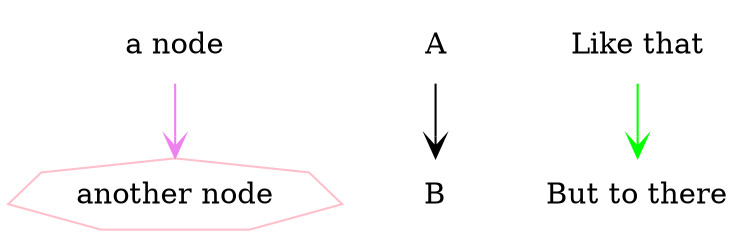
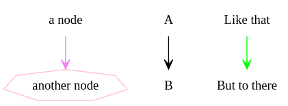
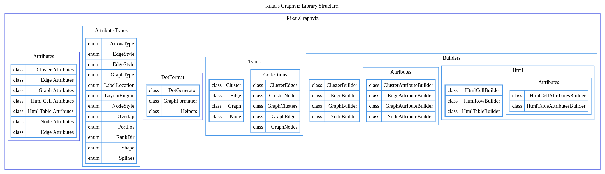

## Rikai's Graphviz Wrapper

This repo is a result of an obsession to (1) create diagrams and visualizations, (2) the primitive monkey brain's desire to use a typed language to compose a diagram, and (3) the
capability to build on top of Graphviz in a strongly-typed workflow without losing your sanity.

I've seen and even used other projects, but personally I prefer to have self-evident strong typing in the classes so, here we are.

### Features

- **strongly typed** wrappers for Graphviz objects and attributes
- it's possible to **define edges** with `1:N`, `N:1`, `N:M` relationships
- **attributes** for `Graph`, `Node`, `Edge`, and `Cluster` are **supported**
- You can create a definition for `NodeAttributes` and you can easly **reuse them** using C# `record` semantics (the reason why I made this in the first place).
- **Fluent API** is supported (but YMMV whether it's nice to use)
- **Clusters** are fully supported.
- **Nested Clusters** are fully supported. Go ham.
- **HTML-like labels** are fully supported. Attributes (e.g. `PORT`, `ALIGN`, `COLSPAN`, etc) are **supported as well**, in a type safe way.

### Samples

Check the `Rikai.Graphviz.Samples` project for examples of the syntax. I've also written comments to (hopefully) explain the thought process behind the API decisions.

Here is an excerpt that uses the Fluent API builders.

```csharp
Graph graph = new GraphBuilder(GraphType.Directed) 
    
    // graph attributes 
    .WithAttributes(graph => graph
        .Splines(Splines.Ortho)
        .BgColor("white")
        .RankDir(RankDir.BT)
    )

    // node attributes
    .WithNodeAttributes(graphNodes => graphNodes
        .Shape(Shape.Rectangle)
        .Style(NodeStyle.Filled)
        .Color("violet")
        .FontSize(9)
    )

    // edge attributes
    .WithEdgeAttributes(graphEdges => graphEdges
        .ArrowHead(ArrowType.Vee)
        .Style(EdgeStyle.Dashed)
        .FontSize(9)
    )
    
    // node
    .AddNode("a node")
    .AddNode("another node", node => node
        .WithAttributes(nodeAttr => nodeAttr
            .Color("pink")
            .Shape(Shape.Septagon)
        )
    )
    
    // edges 
    .AddEdge("A", "B")
    .AddEdge("a node", "another node",  attr => attr.Color("violet"))
    .AddEdge(edge => edge 
        .From("Like that") 
        .To("But to there") 
        .WithAttributes(attr => attr 
        .Color("green")
        ) 
    )
    .Build();
```
which produces the following `dot`


which then produces this diagram:


Lastly, as of **April 4, 2026**, this is a hierarchical diagram of the library, as defined on `Samples/Graphs/LibraryStructure.cs`


### Caveats and Quirks

1. No implementations for any **Graphviz** binary/cli wrapper. `Graph` only has a definition to output its **dot** in `string` format... which you have to print to console, or otherwise place on a stream/file manually.
2. **Consecutive Edges are not yet included**. That is, there is yet no simple API to create an edge defined as `A -> B -> C [color="green"]`. If it turns out I need it later, I
   might implement it however.
3. **Html** are technically just "labels" in OG Graphviz, but here they're implemented as a separate "collection" inside the main Graph and Clusters. This may or may not satisfy
   other's usecases. I may revisit this in the future.
4. By default, the collection for `Clusters` and `HtmlTables` are `Reverse()'d` because Graphviz, **by default renders the last entry first**. I don't why this is the case, but I
   opted to reverse the order for better intuition.
5. Due to the way `port` is defined for Html Cells, in the API for edge declarations, I preferred to parse a string `table_name:port_name` as `"table_name":"port_name"` instead of `"table_name:portname"` in the generated dot (if you are not aware, this is the syntax to point to a specific cell on an Html table). Hence, if you want an edge with an `id` `"My Edge: Name"`, **you must escape it**, e.g. a string `"My Edge//: Name"`. Using the `Label` node attribute is an alternative, if you so wish.